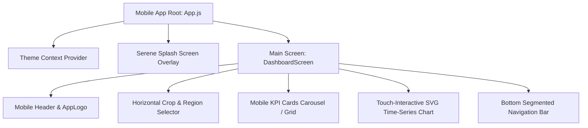

# Implementation Plan: CroFu Mobile App (.apk) Edition

## Goal Description
Build a standalone, high-performance **Mobile Application (.apk)** for the **CroFu Agricultural Price Analytics Engine**. The mobile app will focus strictly on the **Interactive Forecasting & Analytics Dashboard**, omitting the landing page entirely. 

The mobile application must strictly preserve the **identical visual aesthetic, color palette, typography tokens, dark/light theme switching, and interactive capabilities** established in the web project, while re-engineering the UX for mobile touch interaction (iOS/Android native feel, touch chart crosshair inspection, swipe gesture tabs, bottom navigation, and mobile cards).

---

## User Review Required

> [!IMPORTANT]
> **Zero Landing Page Footprint**: The mobile app launches directly into the CroFu Neural Analytics Engine via an unhurried, serene splash screen, proceeding immediately to the main Dashboard.

> [!IMPORTANT]
> **Pure Typographic Logo**: The App Logo is **pure typography** (`CroFu.`), matching the web app with Fraunces serif font and signature gold dot `.`.

---

## Proposed System Architecture & Component Mapping

