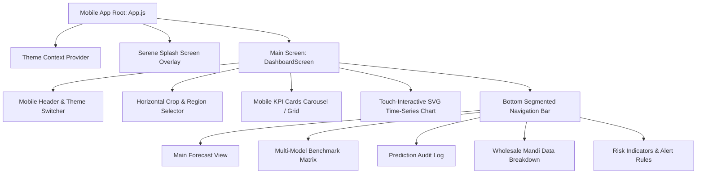

# Implementation Plan: CroFu Mobile App (.apk) Edition

## Goal Description
Build a standalone, high-performance **Mobile Application (.apk)** for the **CroFu Agricultural Price Analytics Engine**. The mobile app will focus strictly on the **Interactive Forecasting & Analytics Dashboard**, omitting the landing page entirely. 

The mobile application must strictly preserve the **identical visual aesthetic, color palette, typography tokens, dark/light theme switching, and interactive capabilities** established in the web project, while re-engineering the UX for mobile touch interaction (iOS/Android native feel, touch chart crosshair inspection, swipe gesture tabs, bottom navigation, and mobile cards).

---

## User Review Required

> [!IMPORTANT]
> **Zero Landing Page Footprint**: The mobile app launches directly into the CroFu Neural Analytics Engine via an unhurried, serene splash screen, proceeding immediately to the main Dashboard.

> [!IMPORTANT]
> **Tech Stack Selection for APK Target**: We recommend **React Native (Expo SDK 51/52)** with **React Native Reanimated**, **React Native SVG** (or **Shopify Skia** for 60fps chart rendering), and **NativeWind (TailwindCSS for RN)**. This allows 100% code and style parity with your current Vite/React project while compiling to an APK via `eas build` or local Android Studio / Gradle builds.

---

## Open Questions

> [!NOTE]
> 1. **Target Mobile Framework**: Would you prefer the AI developer agent to build this with **React Native / Expo** (Recommended for 1-to-1 styling and React component parity) or **Flutter / Capacitor**? *(Plan assumes React Native / Expo)*.
> 2. **Chart Touch Gesture**: On mobile, touch crosshair inspection will support drag-and-hold gestures over the time-series curve to inspect specific date points.

---

## Proposed System Architecture & Component Mapping



---

## Technical File Architecture & Specification Files

We will generate two core markdown artifacts for feeding directly into AI Coding Agents:

1. **`mobile_app_plan.md`** (This file - Architectural overview and component plan)
2. **`mobile_app_spec.md`** (Complete, self-contained technical specification document containing complete design tokens, dataset mathematical formulas, component specifications, SVG chart math, and APK compilation commands).

---

### Component Specifications

#### 1. Design Tokens & Theme Mapping (`constants/theme.ts`)
Map web CSS variables (`--bg`, `--surface`, `--ink`, `--gold`, `--brand`, `--positive`, `--negative`) to React Native theme objects for seamless Dark and Light mode toggling:

```typescript
export const LIGHT_THEME = {
  bg: '#f6f2e7',
  surface: '#ffffff',
  ink: '#1c231e',
  inkSecondary: '#5c6659',
  border: '#e3ddcb',
  brand: '#204a38',
  sage: '#7c9c7f',
  gold: '#b8872e',
  positive: '#4c7a52',
  negative: '#b85c42',
  fontSerif: 'Fraunces',
  fontSans: 'IBMPlexSans',
  fontMono: 'IBMPlexMono',
};

export const DARK_THEME = {
  bg: '#0f1613',
  surface: '#171f1a',
  ink: '#ece7d9',
  inkSecondary: '#93a090',
  border: '#2a342d',
  brand: '#3e8b63',
  sage: '#8fb08f',
  gold: '#e0ac4c',
  positive: '#5fa26a',
  negative: '#d97b5c',
  fontSerif: 'Fraunces',
  fontSans: 'IBMPlexSans',
  fontMono: 'IBMPlexMono',
};
```

#### 2. Touch-Interactive Time-Series Chart Component (`components/InteractiveChart.tsx`)
- Built using `react-native-svg` and `react-native-gesture-handler`.
- Renders:
  - Y-Axis horizontal grid lines and price labels.
  - Chronological $t=0$ (PRESENT) gold dashed cutoff line.
  - Shaded Confidence Band (`Polygon` with `LinearGradient`).
  - Observed Price curve (Solid Emerald Green line).
  - Forecast Trajectory curve (Dashed Amber Gold line).
  - Touch Pan Responder / Drag Gesture to highlight closest date node, display crosshair, and update floating inspection card positioned away from finger occlusion.

#### 3. Mobile Crop & Region Toolbar (`components/CropSelector.tsx`)
- Horizontal scrollable pill bar (`ScrollView horizontal showsHorizontalScrollIndicator={false}`).
- Buttons for **Tomato**, **Onion**, **Potato**, and **Brinjal** featuring high-contrast image fill effects, gold/white adaptive borders, and active state indicators.
- Dropdown modal / action sheet for switching between **National (All-India)** and **Tamil Nadu (State-Level)** regions.

#### 4. Touch-Optimized KPI Cards (`components/KPICards.tsx`)
- Horizontal swipeable carousel or 2x2 compact grid displaying:
  1. **Observed Price**: ₹ Modal Price with 24h delta.
  2. **Target Forecast Price**: Projected price for selected horizon (7d, 14d, 30d).
  3. **Price Range & Volatility**: Min, Max, and $\sigma$ volatility metric.
  4. **Market Arrivals**: Volume in Tonnes with 7d moving average.
  5. **Active Champion Model**: Active AI architecture (XGBoost V3, ARIMA, etc.) with MAPE score.

#### 5. Segmented Bottom Navigation (`components/BottomNav.tsx`)
- Replaces top navigation tabs with an intuitive mobile bottom tab bar:
  - 📈 **Forecast** (Time-Series & Inspection)
  - 📊 **Benchmark** (Multi-Model Comparison Cards)
  - ⚡ **Audit** (Realized Accuracy Table)
  - 🛒 **Mandis** (Searchable Wholesale Mandi List)
  - 🔔 **Alerts** (Risk Indicators & Price Alert Configurator)

---

## Verification Plan

### Automated Verification
- Verify TypeScript compilation: `npx tsc --noEmit`
- Verify Expo project check: `npx expo doctor`
- Validate React Native SVG path calculations via unit tests.

### Manual Verification & APK Generation
- Build standalone Android APK file:
  ```bash
  npx eas-cli build --platform android --profile preview
  ```
- Install APK on Android physical device or emulator.
- Test touch drag interaction across time-series chart nodes.
- Test commodity switching (Tomato, Onion, Potato, Brinjal) and verify dataset math.
- Test Light and Dark theme toggle consistency across all screens.
