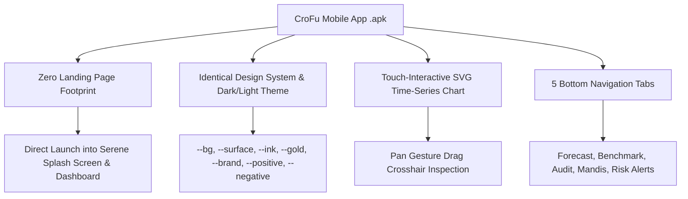

# Walkthrough: CroFu Mobile App (.apk) Planning & Documentation

The architecture and technical documentation for building the standalone **CroFu Mobile App (.apk)** edition have been generated.

---

## Generated Documentation & AI Agent Specification Files

1. **Implementation Plan Document**: [`mobile_app_plan.md`](file:///F:/Project/Cro-Fu/mobile_app_plan.md)  
   *Overview of mobile architecture, design token mapping, component hierarchy, touch gesture inspection, and APK compilation strategy.*

2. **Standalone Technical Specification**: [`mobile_app_spec.md`](file:///F:/Project/Cro-Fu/mobile_app_spec.md)  
   *Complete, self-contained technical specification document containing `package.json` dependencies, React Native theme objects, master dataset generators, and complete TSX component implementations (`SplashScreen.tsx`, `InteractiveChart.tsx`, etc.).*

3. **AI Developer Prompts Guide**: [`mobile_app_prompts.md`](file:///F:/Project/Cro-Fu/mobile_app_prompts.md)  
   *Step-by-step sequential prompts ready to be fed directly into an AI developer agent to build and compile the APK.*

---

## Mobile Architecture Summary

### Key Technical Specs:
- **Framework**: React Native + Expo SDK 51/52 + TypeScript
- **Styling**: NativeWind / Tailwind CSS + React Native StyleSheet
- **Chart Component**: `react-native-svg` + `react-native-gesture-handler` (Observed in Emerald Green, Forecast in Amber Gold, $t=0$ Cutoff line)
- **APK Target**: Compiled via Expo EAS CLI (`eas build -p android --profile preview`)
